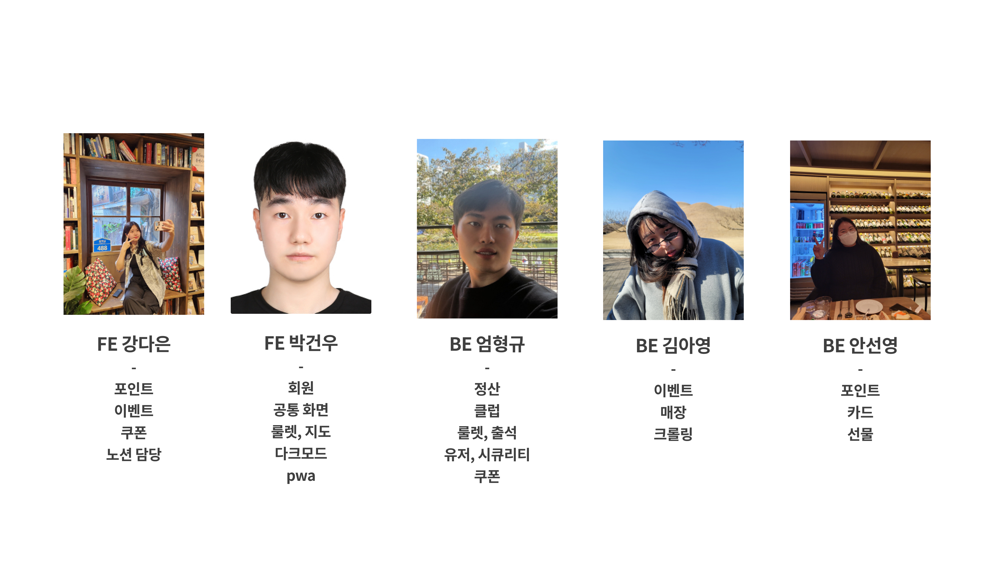

# Front
# 포인트를 쌓고 적립하는 KarinaPoint

 

🔼 클릭하면 UCC로 이동합니다 !

 

##  💁 간단 소개

### "누구나 쉽게 포인트를 쌓고 적립하는 서비스"
회원이 가입하고 이벤트와 자신의 포인트, 출석과 룰렛을 통한 포인트를 쌓고 유저간 선물 기능으로 주고 받을 수 있는 사이트 (휴대폰, 웹 전용)

- 🔗 LINK : https://smilekarina-point.vercel.app
- 🎼 Period : 2023.07.31 ~ 2023.09.18 (8주간 진행)
- 📑 Notion : https://cold-eel-56c.notion.site/9cb79d2785454b389f4975887cb60727?v=87c07bf232d74e28b8d15dbb880a3abe&pvs=4
 

### "작업 파일"
- 📑 Event Stoming : https://miro.com/app/board/uXjVMlIqv7U=/?share_link_id=479010144120
- 📑 ERD : https://www.erdcloud.com/d/tQn8bohpKTm3xmkdy
- 📑 API, 요구사항 정의서, WBS : https://docs.google.com/spreadsheets/d/187mT7rzsiOdJvDZn1QiEwpiCblH_ZM3xRNI8xBltHow/edit?usp=sharing
 

## ✨ 기능 및 화면
### 1) 메인 화면
### Frontend  

  
  
  
  

- 모든 서비스를 접근 할수 있는 페이지 입니다.
 

  
  
  

- 앱으로 설치해서 PWA를 이용해서 볼수 있는 기능을 제공합니다.

 

- UX를 위해서 다크모드를 지원합니다.
 
### 2) 로그인 화면

- 회원가입에는 아이디 찾기, 비밀번호 찾기, 회원가입, 아이디 저장, 자동 로그인 기능을 지원합니다.

  
  
  

- 또한 네이버와 카카오톡을 통해 로그인을 할 수 있습니다.(단 회원가입한 유저에 의해 가능)

 

### 3) 로그인 후 메인 화면

  

- 로그인 한 유저는 자신의 포인트를 확인하고 자신의 포인트카드를 연결할 수 있습니다.
- 멤버십 서비스, 출석체크, 로그인, 쿠폰, 이벤트 등 다양한 기능에 접근할 수 있게 됩니다.
- 로그인 하지 않았을 때 접근 한 경우 로그인 페이지로 리다이랙트 됩니다.

 

### 4) 출석체크와 룰렛기능

- 로그인한 유저는 하루에 한번 룰렛을 할 수 있습니다.

- 로그인한 유저는 하루에 한번 출석을 할 수 있습니다.
- 10일 연속 출석을 한 경우 추가적인 포인트를 획득할 수 있습니다.
 

### 5) 매장 찾기 기능

  

- 프랜차이즈 종류마다 분기해서 매장을 찾을 수 있습니다.
- 해당 프랜차이즈 지점을 선택해서 자주 찾는 매장(자신의 매장)으로 등록할 수 있습니다.

 

### 6) 이벤트 기능

  
  
  

- 진행 이벤트, 종료 이벤트, 당첨 이벤트를 확인할 수 있습니다.
- 해당 이벤트가 몇일 남았는지 종료되었는지 시각적으로 알려줍니다.

 

### 7) 쿠폰 기능

  
  
  

- 다양한 쿠폰을 제공합니다.
- 해당 쿠폰을 다운했을 경우 바코드를 줍니다. 그리고 전체 다운을 통해 UX를 도와줍니다.

 

---

 

## 📃 데이터 명세

 

## 🏋️‍♂️ 기술 스택
### Frontend  

  
   
    
    
    
     

### Backend  

  
    
    
    

### DevOps  

  
    
    
  
    
    
  
    

 

## ⚙ 아키텍처

 

## 🖥️ 실행 방법
[포팅 메뉴얼]()에 자세히 작성되어 있습니다😊 참고해 주세요 !

 

## 팀원 소개

## 개발 참고 자료
[PR 보내는 방법](./Contribute.md)

[Git 참고자료](./Git.md)

[상위 브랜치에서 작업한 경우](./UseUpper.md)
